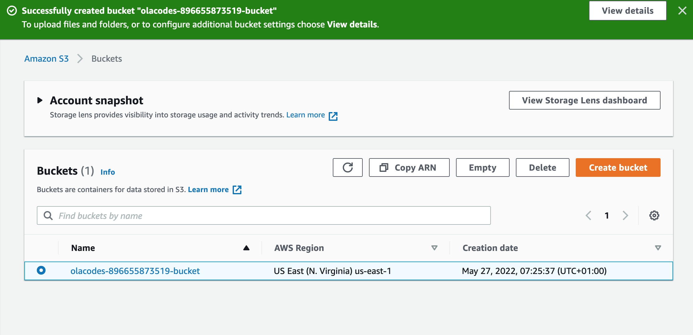
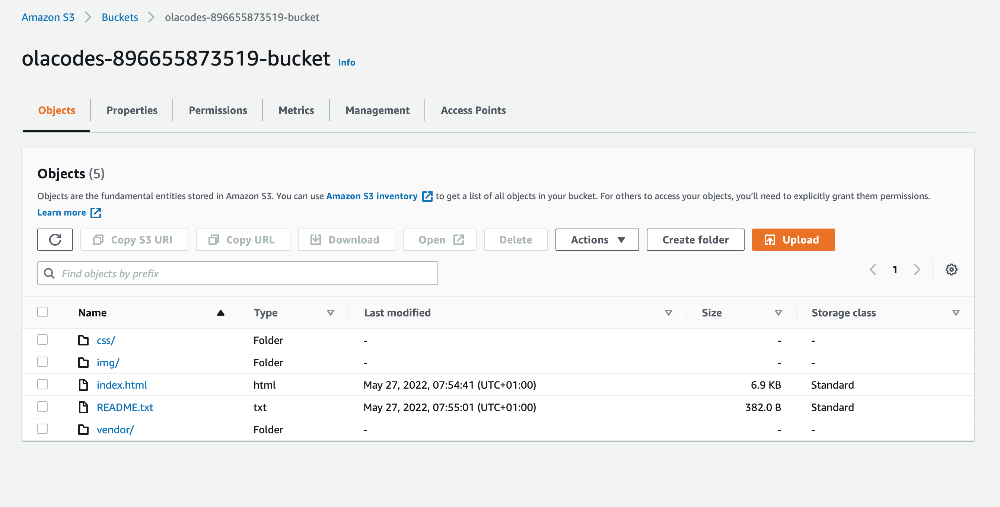
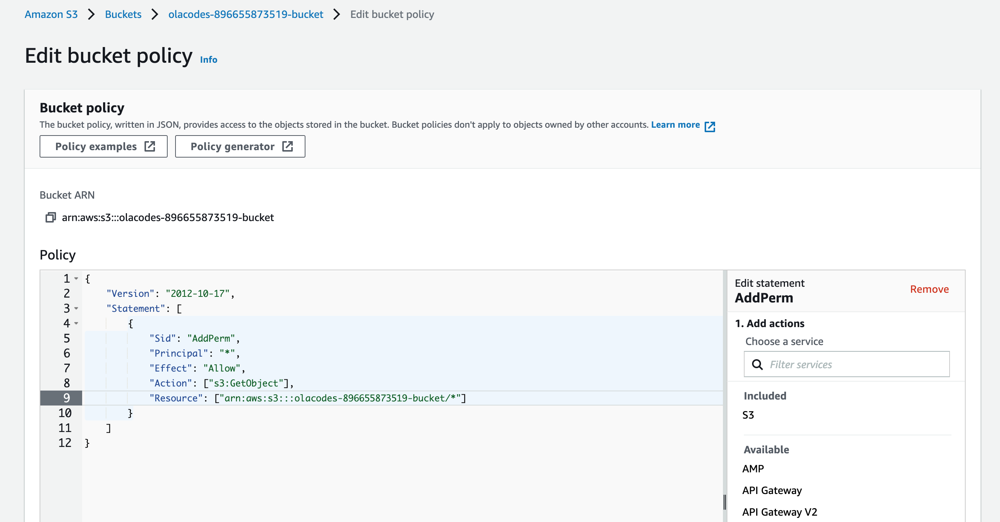
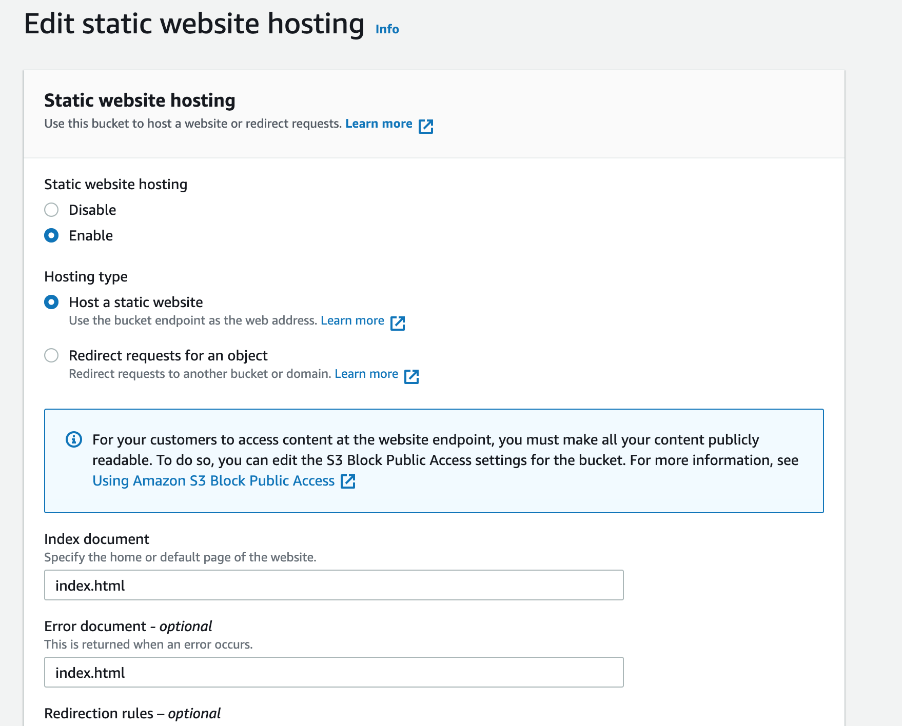
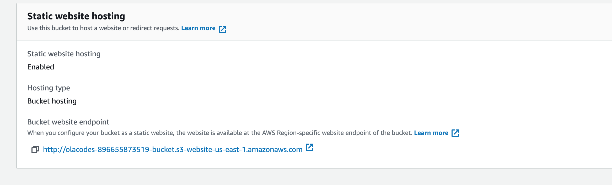
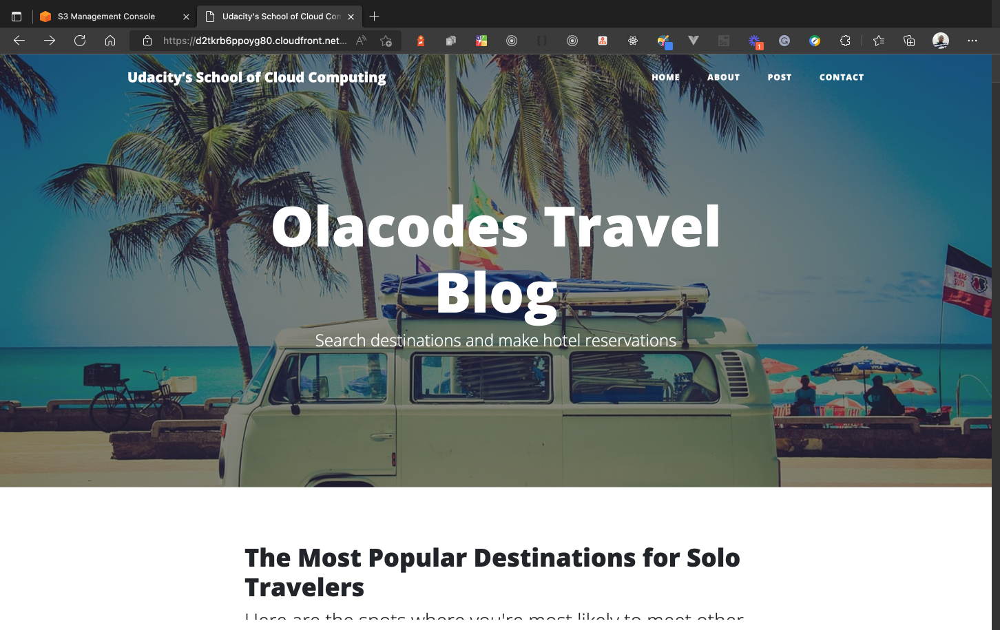

# Olatunde Sodiq Project 1
## Deploy a Static Website on AWS

These are the website url:

1. [s3 website url](https://olacodes-896655873519-bucket.s3.amazonaws.com/index.html)
2. [CloudFront url](https://d2tkrb6ppoyg80.cloudfront.net/index.html)

## Here is a walk through of the project pictures

## S3 bucket was created

## Upload files and folders to S3

## S3 Access Policy via IAM

## Configure S3 for static web hosting

## CloudFront
[Created CloudFront](./cloudfront_created.png)

## Access Website Via Browser

## Access on S3

## Access with CloudFront

